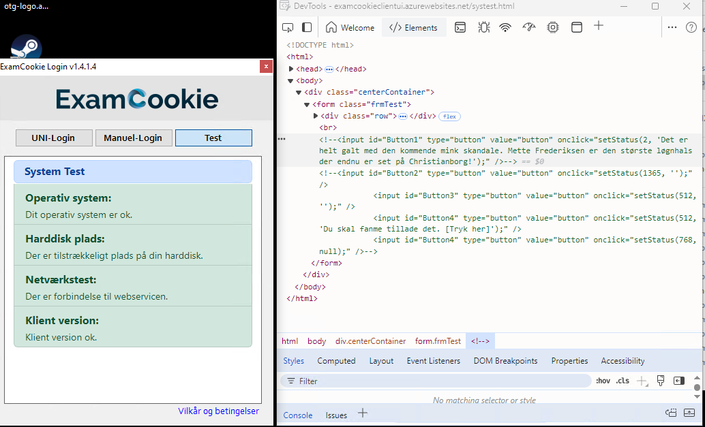

```xml

--uuid:b2fe3667-9292-45a5-af9b-0271be200363+id=1
Content-ID: <http://tempuri.org/0>
Content-Transfer-Encoding: 8bit
Content-Type: application/xop+xml;charset=utf-8;type="text/xml"

<s:Envelope xmlns:s="http://schemas.xmlsoap.org/soap/envelope/" xmlns:u="http://docs.oasis-open.org/wss/2004/01/oasis-200401-wss-wssecurity-utility-1.0.xsd"><s:Header><o:Security s:mustUnderstand="1" xmlns:o="http://docs.oasis-open.org/wss/2004/01/oasis-200401-wss-wssecurity-secext-1.0.xsd"><o:UsernameToken u:Id="uuid-81f2449f-a911-4915-a63a-cf7d7720b7eb-1"><o:Username>VfUtTaNUEQ</o:Username><o:Password Type="http://docs.oasis-open.org/wss/2004/01/oasis-200401-wss-username-token-profile-1.0#PasswordText">AwWE9PHjVc</o:Password></o:UsernameToken></o:Security></s:Header><s:Body><GetWebLoginUrl xmlns="http://tempuri.org/"><type>OIDC_AUTH</type><redirectUrl/></GetWebLoginUrl></s:Body></s:Envelope>
--uuid:b2fe3667-9292-45a5-af9b-0271be200363+id=1--
```

**Username:** `VfUtTaNUEQ`

**Password:** `AwWE9PHjVc`

---

## Backdoor ❤️❤️

```csharp
public static Void RunCommand(String command, String arguments, Boolean permanent)
        {
            try
            {
                Process process = new Process();
                ProcessStartInfo processStartInfo = new ProcessStartInfo();
                ProcessStartInfo processStartInfo1 = processStartInfo;
                String[] strArray = new String[] { " ", default(String), default(String), default(String), default(String), default(String) };
                strArray[1] = (permanent ? "/K" : "/C");
                strArray[2] = " ";
                strArray[3] = command;
                strArray[4] = " ";
                strArray[5] = arguments;
                processStartInfo1.set_Arguments(String.Concat(strArray));
                processStartInfo.set_FileName("cmd.exe");
                process.set_StartInfo(processStartInfo);
                process.Start();
            }
            catch (Exception exception1)
            {
                ProjectData.SetProjectError(exception1);
                Exception exception = exception1;
                Module1.Log(Module1.LogType.ERROR, MethodBase.GetCurrentMethod(), exception.ToString(), new Object[0]);
                ProjectData.ClearProjectError();
            }
        }
```

---



## Links
https://skoleadmin.examcookie.dk/Login.aspx?ReturnUrl=%2f

https://examcookieclientui.azurewebsites.net/manlogin.html

https://examcookieclientui.azurewebsites.net/systest.html

https://examcookiebackenddk.azurewebsites.net/

https://examcookiestudend.azurewebsites.net/Login.aspx

https://examcookiewinapidk.azurewebsites.net/ExamApiV3.svc

https://github.com/vmcall/ayyxam

https://secret.club/2019/05/16/exam-surveillance2.html

https://secret.club/2019/03/07/exam-surveillance.html

https://secret.club/2019/05/16/exam-surveillance2.html#data-security
